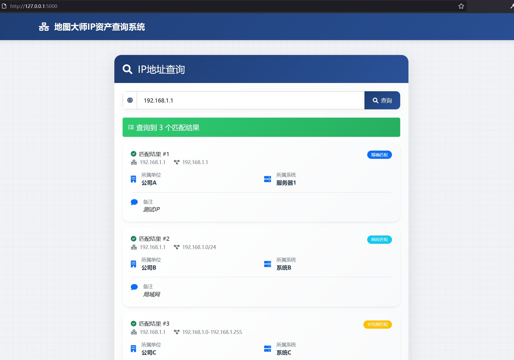
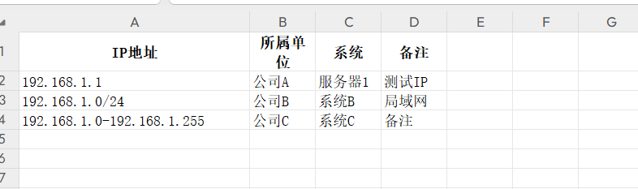

# 🗺️ 地图大师 IP 资产查询系统

在护网项目或日常安全运营工作中，大家经常会遇到对各种IP归属不清楚、反复找业务方或者网管问询的情况。为了解决这个痛点，我开发了一个工具，使用半年以来效果非常好。现在分享给大家，帮助大家轻松查询IP归属。无论是在护网项目中，还是日常安全运营时，都可以将客户IP资产批量导入使用，或者积累整理IP段，后续查询更加便捷高效。最初是php+mysql开发的，但是觉得这个不方便大家使用所以搞了个python的，打包成exe，大家直接修改好自己的excel表格即可轻松使用。

一个轻量级、离线可部署的 IP 资产查询系统，支持精确 IP、IP 段（CIDR）、IP 范围查询，通过 Excel 管理数据源，快速查询对应IP所属的公司及系统名等。

（肯定有人要问为啥不直接查excel，因为excel遇到192.168.0.0/16及192.168.1.1-192.168.1.255这种格式你去查192.168.1.244就查不出来了，还有...）

---


## ✨ 功能特点

- ✅ 支持精确 IP、CIDR 网段、IP 范围查询
- ✅ 使用 Excel 管理 IP 数据，维护便捷
- ✅ 前后端分离，界面简洁美观
- ✅ 全本地化静态资源，**离线可用**
- ✅ 响应式 UI，支持桌面和移动设备访问

---

## 📂 项目结构

├── ip_query_server.py # Flask 后端服务

├── index.html # 前端页面

├── ip_data.xlsx # IP 数据库文件（Excel）

├── static/ # 本地静态资源(图表等，为了好看点)


---

## 📊 Excel 数据格式说明（ip_data.xlsx）



| IP地址                     | 所属单位 | 系统名称   | 备注说明    |
|---------------------------|----------|------------|-------------|
| 192.168.1.1               | 公司A    | 内部网     | 精确IP测试  |
| 10.0.0.0/8                | 公司B    | 内网段     | CIDR格式    |
| 123.150.66.229-123.150.66.255 | 公司C | 外部访问段 | IP范围测试  |

- 第一行为表头，从第二行开始是数据
- **支持以下 IP 格式：**
  - `192.168.1.1`（精确 IP）
  - `10.0.0.0/8`（CIDR 网段）
  - `123.150.66.1-123.150.66.100`（IP 范围）

---

## 🚀 快速开始
第一种方式：直接下载我打包成exe的zip压缩包，双击ip_query_server.exe执行即可

https://github.com/returnwrong/ipsearch/releases/download/v1.0/ipquery0.1.zip


第二种方式：
### 1️安装依赖

```bash
pip install flask openpyxl
```

### 2启动服务

```bash
python ip_query_server.py
```

### 3访问系统

```bash
http://127.0.0.1:5000
```
ps.如果要自己打包成exe安装好pyinstaller使用如下命令即可
```bash
pyinstaller --onefile --add-data "ip_data.xlsx;." --add-data "index.html;." --add-data "static;static"  ip_query_server.py
```
